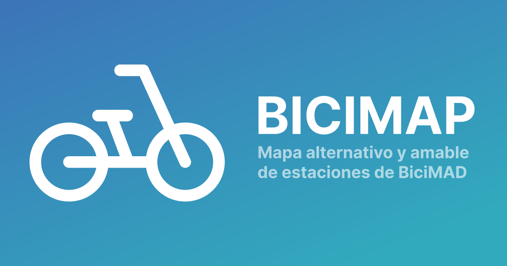

# Bicimap

🌍 Unofficial map of BiciMAD & Bicing stations. 

This project is my attempt to make a friendlier version of the current [BiciMAD](https://u.bicimad.com/mapa) and [Bicing](https://bicing.barcelona/mapa-de-disponibilitat) bike-sharing maps. Visit the map [here](https://bicimap.javierarce.com)

### HOW TO INSTALL IT

- Clone this repo with `git clone git@github.com:javierarce/bicimap.git`
- Install its dependecies: `cd bicimap; yarn`
- Retrieve the stations data: `node public/stations.js`
- Run the server: `yarn serve`
- Follow the instructions in your terminal.

### TODO

- [ ] Add tooltips for the map controllers.
- [ ] Add routing between stations.

### WISHLIST

- [ ] Add weather information.
- [ ] Allow marking stations as favorites for easier access.
- [ ] Show nearby stations to a given station.

### DONE

- [x] Add address search
- [x] Add air quality information using [aire-madrid](https://github.com/javierarce/aire-madrid)
- [x] Create PWA
- [x] Add screenshot/GIF in this documentation
- [x] Add station refresh on a set interval
- [x] Add installation instructions
- [x] Fix popup issues on mobile / Safari
- [x] Launch project
- [x] Improve tooltips (style and content)
- [x] Save (and load) last position in the map
- [x] Improve bike lane style
- [x] Open the infowindows on click
- [x] Add about page
- [x] Add toggle to show/hide bike lanes
- [x] Show spinner while the user position is being fetched
- [x] Remove clustering
- [x] Add toggle to switch between modes (picking / leaving a bike)
- [x] Show bike lanes
- [x] Fix header for small screens
